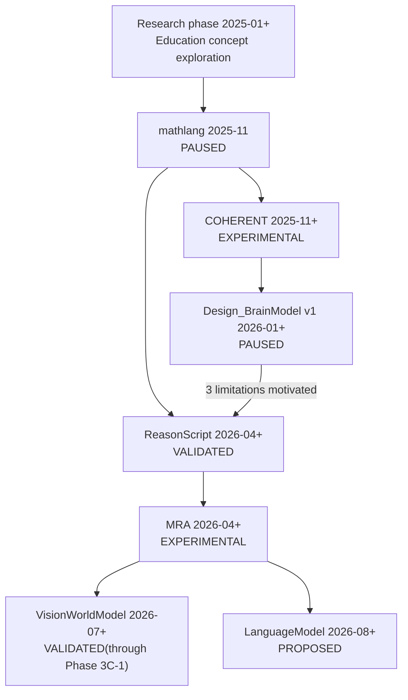

# Portfolio — Research & Engineering on Verifiable Reasoning Systems

*[日本語版 →](README_ja.md)*

## Research-oriented Software Engineer

**A software engineer researching and building AI reasoning infrastructure and deterministic systems.**
Turning hypotheses about complex reasoning systems into specifications, working software, reproducible experiments, and verification evidence.

| | |
|---|---|
| **Target roles** | AI Systems Engineer / Research Software Engineer / QA & Validation Engineer (details: [Career Direction](career/career_direction.md)) |
| **Core stack** | Python & Rust / DSL, AST, IR & runtime design / test strategy & regression verification / AI reasoning system evaluation |
| **Featured projects** | [ReasonScript](projects/reasonscript.md) · [MRA](projects/mra.md) · [COHERENT](projects/coherent.md) |
| **GitHub** | [@chigenori053](https://github.com/chigenori053) |

Every claim in this portfolio is labeled with its evidence strength (measured / execution-verified / design-check only / unmeasured / non-reproducible). Weakly-supported numbers are never presented as strong results — see the [Verification Matrix](evidence/verification_matrix.md) for the full policy.

> **Note on language**: The README pages (this file and [README_ja.md](README_ja.md)) are kept in sync on all facts, statuses, numbers, and links. Detail pages under `career/`, `projects/`, `evidence/`, `case-studies/`, `methodology/`, and `history/` are written in Japanese, the language of the primary (Japan-based) job market this portfolio targets. If you need a specific page translated, please open an issue.

---

## Profile Summary

I run a programming school, designing curricula and teaching, and independently of that, since January 2025, have explored building an AI tool to support math learning — consulting education specialists and evaluating existing services such as Wolfram Alpha — before implementing the resulting concept as the [mathlang](projects/mathlang.md) DSL in November 2025.

From there, I have spent roughly 19 months researching and building a response to LLMs' **non-determinism, unverifiability, and loss of design intent**: a deterministic language runtime ([ReasonScript](projects/reasonscript.md)) and a reasoning architecture that separates memory from truth ([MRA](projects/mra.md)). The cycle of **hypothesis → specification → implementation → experiment → failure analysis → redesign** appears concretely across projects — for example, [three limitations of Design_BrainModel v1 that directly motivated ReasonScript](projects/design_brainmodel.md#limitations).

All seven projects below are personal work: I own the design, implementation, and verification of each (with AI coding agents used as an implementation accelerator — see [responsibility boundaries](methodology/ai_assisted_development.md)). I am seeking a full-time engineering role.

→ Details: [Professional Profile](career/professional_profile.md) · [Professional Experience](#professional-experience)

---

## What I Can Contribute

- Specifying complex concepts (MUST/MUST NOT-style specifications, phase-based verification design)
- DSL / IR / runtime design (state-transition semantics, deterministic compilation pipelines)
- Implementation in Python and Rust (Hybrid DSLs, large Rust workspaces)
- Test strategy and regression verification (CI, golden corpora, conformance frameworks)
- Designing for determinism, reproducibility, and auditability (canonicalization, Evidence/Provenance, determinism gates)
- Evaluating AI systems and analyzing failures (isolating reasoning explosions, catching and correcting overclaims)
- Technical writing (specifications, verification reports, case studies)
- Teaching, explanation, and stakeholder coordination (running a programming school, PM experience)

---

## Featured Projects

### 1. ReasonScript — a state-transition language for describing reasoning

| | |
|---|---|
| **Problem** | LLM-driven workflows lack reproducibility, leave no audit trail, and have no safe unit to roll back to on failure |
| **Approach** | Reasoning is written as six state-transition primitives (`goal`/`derive`/`prove`/`apply`/`converge`/`rollback`), with automatic rollback on proof failure built into the language semantics |
| **Architecture** | 4-stage IR pipeline (Surface AST → Semantic AST → Reason IR → ExecutionPlan), 7 purpose-built runtimes |
| **Languages** | **Hybrid DSL** — Python front end / Rust runtime (with a 5-language DTO contract) |
| **Validated** | `./reason ci --json` executed — **all stages PASS, 1,116 tests** (2026-08-12, commit `0efb2ab`) |
| **Status** | **VALIDATED** (some peripheral tooling not yet implemented) |
| **Links** | [Project page](projects/reasonscript.md) · [Runtime case study](case-studies/reasonscript_runtime.md) · [GitHub](https://github.com/chigenori053/ReasonScript) (Apache-2.0) |

### 2. MRA — Molecular Reasoning Architecture

| | |
|---|---|
| **Problem** | Treating associative-memory similarity (vector search) as knowledge conflates "semantically close" with "the relation actually holds," making hallucination structurally unavoidable |
| **Approach** | Knowledge is represented as a **Molecule** — typed Atoms and Bonds carrying Evidence and Provenance. Associative memory is scoped to a "candidate-only" layer — the **Truth Boundary** |
| **Architecture** | ReasonUnit / Relation / Molecule, deployed across three domains: vision, language, and software design |
| **Languages** | Specification-led (each domain model is implemented in ReasonScript/Python) |
| **Validated** | One domain model, [VisionWorldModel](projects/vision_world_model.md), is validated through Phase 3C-1. Cross-domain integration of MRA as a whole is not yet verified |
| **Status** | **EXPERIMENTAL** (data model and Truth Boundary are established as specification; integration across domains remains open) |
| **Links** | [Project page](projects/mra.md) · [Deterministic reasoning case study](case-studies/deterministic_reasoning.md) |

### 3. COHERENT — theory-validation for non-Transformer reasoning

| | |
|---|---|
| **Problem** | Can a non-Transformer reasoning model achieve LLM-like reasoning? (theory validation, not a product) |
| **Approach** | Simulated optical interference (HolographicMemory) plus a Recall-First architecture with a three-way Accept/Review/Reject decision |
| **Architecture** | Dynamic/Static/Causal HolographicMemory layers, MemorySpace |
| **Languages** | Python (~43,000 LOC) |
| **Validated** | **100% recall over 60 Japanese/English words, 0.00% degradation when mixed** (measured resonance-value CSV). Equation correctness judgment also succeeds. The compute-reduction-from-memory-reuse hypothesis remains **unmeasured** |
| **Status** | **EXPERIMENTAL** (evidence strength varies significantly by claim) |
| **Links** | [Project page](projects/coherent.md) · [GitHub](https://github.com/chigenori053/COHERENT) |

→ All 7 projects: [Project Index](projects/project_index.md)

---

## Engineering Evidence

Beyond raw test counts, evidence is organized by verification dimension (full detail: [Verification Matrix](evidence/verification_matrix.md)).

| Dimension | Implementation | Project |
|---|---|---|
| Schema validation | JSON-Schema-checked IR and data models | ReasonScript (Reason IR), LanguageModel (Molecule) |
| Deterministic planning | Same input → same ExecutionPlan | ReasonScript |
| Byte-identical artifacts | Required exact hash match | Design_BrainModel (`snapshot_v2`) |
| Golden tests | Expected-value comparison of intermediate representations | ReasonScript (`golden/`) |
| Atomic state transitions | Immutable candidate → validation → state migration → commit | VisionWorldModel |
| Rollback | Automatic rollback on proof failure | ReasonScript (`apply`/`rollback`) |
| Provenance verification | Recorded rationale and lineage | COHERENT (DecisionLog), LanguageModel (Evidence) |
| Regression prevention | CI and conformance-driven regression protection | ReasonScript (1,116 CI tests) |

→ [Verification Matrix](evidence/verification_matrix.md) · [Reproducibility](evidence/reproducibility.md) · [Test Strategy](evidence/test_strategy.md) · [Benchmark Summary](evidence/benchmark_summary.md)

---

## Research and Development Lineage

The seven projects are not an independent product lineup — they are one continuous line of research starting from the MathLang concept.

The underlying question shifts from "describe it" → "control it" → "rebuild the foundation" → "deploy the foundation across multiple domains."

→ [Full research lineage](history/research_lineage.md) (research-phase background, causal links between projects)

---

## Professional Experience

- **Programming education** — I run a programming school. While considering a new math curriculum there in January 2025, I conceived of an LLM-based learning coach, consulted education specialists, and evaluated SymbolicAI/Wolfram Alpha (details: [Research Lineage](history/research_lineage.md#2025年1月10月--リサーチ期-コンセプトを固める))
- **PM experience** — Project-management experience related to system development; a generalized, confidentiality-safe write-up is still pending

> Items needed for a formal resume (work history, education, certifications, etc.) are tracked as a checklist in [Professional Profile → items to fill in](career/professional_profile.md#記入が必要な項目).

---

## Technical Skills

Mapping research outcomes to capabilities usable in a company engineering context (full list: [Engineering Skills](career/engineering_skills.md)).

| Research outcome | Applicable engineering capability |
|---|---|
| Reason IR / ExecutionPlan | Compiler design, data-processing pipelines, execution planning |
| Canonicalization | Reproducible processing, caching, audit-log design |
| Golden tests / regression tests | QA, test automation, quality assurance |
| Evidence / Provenance | AI governance, audit logging, explainability |
| Atomic transactions / rollback | Safe state updates, failure recovery |
| Hypothesis testing & failure analysis | AI evaluation, PoC design, experiment design |

**Stack**: language implementation (lexing/parsing, AST, IR, type systems) · Rust (60+ crate workspace, Safe-Rust) · Python (SymPy, pytest) · cross-language DTO contracts (5 languages) · AI & reasoning (HRR/VSA, symbolic reasoning, causal inference)

→ [Engineering Skills (full list)](career/engineering_skills.md)

---

## Development Methodology

Five principles run through every project, collected under **[Evidence-Driven Architecture Engineering (EDAE)](methodology/edae.md)**:

1. Determinism and reproducibility guaranteed by specification, not effort
2. Separating "memory" from "truth" (the Truth Boundary)
3. Withholding judgment is a first-class, legitimate output (ACCEPT/REVISE/DEFER/ABSTAIN)
4. Specification first, progress cut into phases
5. Treating collaboration with AI itself as a design problem

AI coding agents are used as implementation and thinking accelerators; final technical judgment — problem framing, architectural decisions, interpreting results, redesign calls — stays with me. This is disclosed in [AI-Assisted Development: Responsibility Boundaries](methodology/ai_assisted_development.md), including a real example of catching and correcting an overclaim by going back to primary data.

→ [EDAE (full detail)](methodology/edae.md) · [AI-Assisted Development](methodology/ai_assisted_development.md)

---

## Current Focus

| Project | Status | Current focus |
|---|---|---|
| [ReasonScript](projects/reasonscript.md) | VALIDATED | ReasonGraph/World viewers, package registry |
| [MRA](projects/mra.md) | EXPERIMENTAL | Verifying deployment across 3 domains (vision, language, software design) |
| [VisionWorldModel](projects/vision_world_model.md) | VALIDATED (through Phase 3C-1) | Extending adaptive structural reasoning |
| [LanguageModel](projects/language_model.md) | PROPOSED (through Phase 0) | Starting Holographic Core implementation (Phase 1) |
| [Design_BrainModel](projects/design_brainmodel.md) | PAUSED (v1) / PROPOSED (v2) | v2 redesign on ReasonScript + MRA Base |
| [COHERENT](projects/coherent.md) | EXPERIMENTAL | Measuring the compute-reduction effect of memory reuse |
| [mathlang](projects/mathlang.md) | PAUSED | No plans to resume (ideas carried into later projects) |

---

## Project Index

| Project | Summary | Status |
|---|---|---|
| [ReasonScript](projects/reasonscript.md) | State-transition language for describing reasoning (foundation) | VALIDATED |
| [MRA](projects/mra.md) | Molecular Reasoning Architecture | EXPERIMENTAL |
| [VisionWorldModel](projects/vision_world_model.md) | MRA vision domain model | VALIDATED (Phase 3C-1) |
| [LanguageModel](projects/language_model.md) | MRA language domain model | PROPOSED |
| [Design_BrainModel](projects/design_brainmodel.md) | Coding agent that recalls code from design intent | PAUSED (v1) |
| [COHERENT](projects/coherent.md) | Theory-validation of non-Transformer reasoning (BrainModel) | EXPERIMENTAL |
| [mathlang](projects/mathlang.md) | Math-learning support language (origin of the lineage) | PAUSED |

→ [Project Index (full table)](projects/project_index.md)

---

## Licensing

The policy is to **open the foundational tooling and reserve the research architecture itself.** ReasonScript and mathlang are published under Apache-2.0. The MRA domain models (VisionWorldModel/LanguageModel/Design_BrainModel) and COHERENT are all-rights-reserved but published for reading and evaluation — open an issue on the relevant repository if you're interested in using them.

## Contact

- **GitHub**: [@chigenori053](https://github.com/chigenori053)
- Please reach out via an issue on the relevant repository

---

## Documentation Map

| Category | Contents |
|---|---|
| [career/](career/) | Professional Profile, Engineering Skills, Career Direction |
| [projects/](projects/) | Detail pages for all 7 projects, Project Index |
| [evidence/](evidence/) | Verification Matrix, Reproducibility, Test Strategy, Benchmark Summary |
| [case-studies/](case-studies/) | ReasonScript Runtime, Deterministic Reasoning |
| [methodology/](methodology/) | EDAE, AI-Assisted Development responsibility boundaries |
| [history/](history/) | Research lineage, archived designs |
