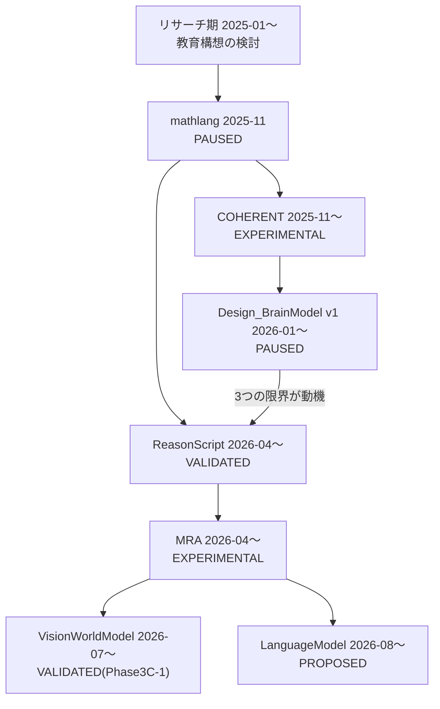

# Portfolio — 検証可能な推論システムの研究開発

*[English version →](README.md)*

## Research-oriented Software Engineer

**AI推論基盤・決定論的システムを研究開発するソフトウェアエンジニア。**
複雑な推論システムの仮説を、仕様、実行可能なソフトウェア、再現可能な実験、検証証拠へ変換します。

| | |
|---|---|
| **対象職種** | AI Systems Engineer / Research Software Engineer / QA・Validation Engineer(詳細: [希望職種](career/career_direction.md)) |
| **主要技術** | Python・Rust / DSL・AST・IR・Runtime設計 / テスト戦略・回帰検証 / AI推論システムの評価 |
| **代表プロジェクト** | [ReasonScript](projects/reasonscript.md) · [MRA](projects/mra.md) · [COHERENT](projects/coherent.md) |
| **GitHub** | [@chigenori053](https://github.com/chigenori053) |

本ポートフォリオでは、主張ごとに証拠の強さ(実測 / 実行結果 / 設計確認のみ / 未測定 / 再現不可)を明示しています。裏付けの弱い数字を強い成果として提示しないことを方針としています(詳細: [Verification Matrix](evidence/verification_matrix.md))。

---

## Profile Summary

プログラミング教室を運営し、教育カリキュラムの設計・指導に携わる一方、2025年1月から数学学習を支援するAIツールの構想を検討し、専門家への相談とWolfram Alpha等の既存サービス検証を経て、2025年11月に自作DSL [mathlang](projects/mathlang.md) として実装しました。

そこから、**LLMの非決定性・検証不可能性・設計意図の喪失**という課題に対し、決定論的な言語処理系([ReasonScript](projects/reasonscript.md))と、記憶と真実を分離した推論アーキテクチャ([MRA](projects/mra.md))を設計・実装する研究開発を、約1年7ヶ月にわたり継続しています。**仮説設定→仕様化→実装→実験→失敗分析→再設計**という反復を、[Design_BrainModel v1の3つの限界からReasonScriptへの転換](projects/design_brainmodel.md#limitations)など、複数のプロジェクトで実際に行ってきました。

以下7プロジェクトはすべて個人プロジェクトであり、設計・実装・検証を単独で担当しています(AIコーディングエージェントを実装補助として併用。責任分界は[こちら](methodology/ai_assisted_development.md))。正社員エンジニア職を志向しています。

→ 詳細: [Professional Profile](career/professional_profile.md) · [Professional Experience](#professional-experience)

---

## What I Can Contribute

- 複雑な概念の仕様化(MUST/MUST NOT規範語による仕様書、Phase単位の検証設計)
- DSL / IR / Runtime設計(状態遷移意味論、決定論的コンパイルパイプライン)
- Python / Rustによる実装(Hybrid DSL、大規模Rustワークスペース)
- テスト戦略と回帰検証(CI、Goldenコーパス、Conformanceフレームワーク)
- 決定性・再現性・監査可能性の設計(正規化、Evidence/Provenance、決定論ゲート)
- AIシステムの評価と失敗分析(推論爆発の切り分け、過大主張の検出と訂正)
- 技術文書作成(仕様書、検証レポート、ケーススタディ)
- 教育・説明・関係者調整(プログラミング教室運営、PM経験)

---

## Featured Projects

### 1. ReasonScript — 推論を記述する状態遷移記述言語

| | |
|---|---|
| **課題** | LLMワークフローは再現性がなく、根拠が残らず、失敗時に安全に戻せない |
| **解決アプローチ** | 推論を6つの状態遷移プリミティブ(`goal`/`derive`/`prove`/`apply`/`converge`/`rollback`)で記述させ、証明失敗時の自動ロールバックを言語意味論に組み込む |
| **主要構成** | 4段階中間表現(Surface AST → Semantic AST → Reason IR → ExecutionPlan)、7種のランタイム |
| **実装言語** | **Hybrid DSL** — 実行系: Python / ランタイム: Rust(5言語DTO契約) |
| **検証済み内容** | `./reason ci --json` 実行、**全ステージPASS・1,116件のテスト通過**(2026-08-12, commit `0efb2ab`) |
| **Status** | **VALIDATED**(周辺ツール一部未実装) |
| **リンク** | [プロジェクト詳細](projects/reasonscript.md) · [Runtimeケーススタディ](case-studies/reasonscript_runtime.md) · [GitHub](https://github.com/chigenori053/ReasonScript)(Apache-2.0) |

### 2. MRA — Molecular Reasoning Architecture

| | |
|---|---|
| **課題** | 連想記憶(ベクトル類似度)をそのまま知識として扱うと、「意味的に近い」と「関係が成立する」を混同し幻覚を排除できない |
| **解決アプローチ** | 知識を型付きAtom/Bondからなる**Molecule**として表現し、Evidence/Provenanceを伴う正規データとして扱う。連想記憶は候補を出す層に限定する**Truth Boundary** |
| **主要構成** | ReasonUnit / Relation / Molecule、視覚・言語・ソフトウェア設計3ドメインへの展開 |
| **実装言語** | 仕様書中心(各ドメインモデルはReasonScript/Python) |
| **検証済み内容** | ドメインモデルの一つ[VisionWorldModel](projects/vision_world_model.md)がPhase 3C-1まで検証完了。MRA全体としての3ドメイン統合はまだ未検証 |
| **Status** | **EXPERIMENTAL**(データモデル・Truth Boundaryは仕様として確立、統合検証は未了) |
| **リンク** | [プロジェクト詳細](projects/mra.md) · [決定論的推論ケーススタディ](case-studies/deterministic_reasoning.md) |

### 3. COHERENT — 非Transformer推論の理論検証

| | |
|---|---|
| **課題** | Transformer以外の推論モデルでLLMと同様の推論を実現できるか(理論検証) |
| **解決アプローチ** | 光学干渉のシミュレーション(HolographicMemory)と、想起優先(Recall-First)アーキテクチャによる三値判定(Accept/Review/Reject) |
| **主要構成** | Dynamic/Static/CausalのHolographicMemory、MemorySpace |
| **実装言語** | Python(約43,000行) |
| **検証済み内容** | **日英60語の想起100%・混在劣化率0.00%**(実測共鳴値つきCSV)。数式正誤判定も成功。記憶再利用による計算削減効果は**未測定** |
| **Status** | **EXPERIMENTAL**(証拠の強さは項目により大きく異なる) |
| **リンク** | [プロジェクト詳細](projects/coherent.md) · [GitHub](https://github.com/chigenori053/COHERENT) |

→ 全7プロジェクト: [Project Index](projects/project_index.md)

---

## Engineering Evidence

テスト総数だけでなく、検証観点ごとの証拠を明示します(詳細: [Verification Matrix](evidence/verification_matrix.md))。

| 検証観点 | 実装 | プロジェクト |
|---|---|---|
| Schema validation | JSON Schemaによる中間表現・データモデル検証 | ReasonScript(Reason IR)、LanguageModel(Molecule) |
| Deterministic planning | 同一入力→同一ExecutionPlan | ReasonScript |
| Byte-identical artifacts | ハッシュの完全一致要求 | Design_BrainModel(`snapshot_v2`) |
| Golden tests | 中間表現の期待値比較 | ReasonScript(`golden/`) |
| Atomic state transitions | 不変候補→検証→状態移行→コミット | VisionWorldModel |
| Rollback | 証明失敗時の自動ロールバック | ReasonScript(`apply`/`rollback`) |
| Provenance verification | 根拠・来歴の記録 | COHERENT(DecisionLog)、LanguageModel(Evidence) |
| Regression prevention | CI・Conformanceによる回帰防止 | ReasonScript(CI 1,116件) |

→ [Verification Matrix](evidence/verification_matrix.md) · [Reproducibility](evidence/reproducibility.md) · [Test Strategy](evidence/test_strategy.md) · [Benchmark Summary](evidence/benchmark_summary.md)

---

## Research and Development Lineage

7プロジェクトは独立した製品群ではなく、MathLangのコンセプトを起点とする一つの研究発展です。

問題意識は「記述する→制御する→基盤から作る→基盤の上で複数ドメインに展開する」と移り変わっています。

→ [研究系譜の詳細](history/research_lineage.md)(リサーチ期の経緯、プロジェクト間の因果関係)

---

## Professional Experience

- **プログラミング教育** — プログラミング教室を運営。2025年1月に数学学習コース新設を検討する中でLLM学習コーチの着想を得て、専門家相談・SymbolicAI/Wolfram Alpha検証を実施(詳細: [研究系譜](history/research_lineage.md#2025年1月10月--リサーチ期-コンセプトを固める))
- **PM経験** — システム開発に関連するPM経験あり。守秘義務の範囲で一般化した詳細は記入予定

> 職歴・学歴・保有資格など職務経歴書として必要な項目は、[Professional Profile の記入が必要な項目](career/professional_profile.md#記入が必要な項目)にチェックリストとして整理しています。

---

## Technical Skills

研究開発上の成果を、企業開発で利用できる能力へ対応付けます(全項目: [Engineering Skills](career/engineering_skills.md))。

| 研究開発上の成果 | 企業開発で利用できる能力 |
|---|---|
| Reason IR / ExecutionPlan | コンパイラ、データ処理基盤、実行計画生成 |
| Canonicalization | 再現可能な処理、キャッシュ、監査ログ設計 |
| Golden Test / 回帰テスト | QA、テスト自動化、品質保証 |
| Evidence / Provenance | AIガバナンス、監査ログ、説明可能性 |
| Atomic Transaction / Rollback | 安全な状態更新、障害復旧 |
| 仮説検証・失敗分析 | AI評価、PoC設計、実験設計 |

**技術スタック**: 言語処理系(字句・構文解析、AST、IR、型システム) / Rust(60+ crateワークスペース、Safe-Rust) / Python(SymPy、pytest) / クロス言語DTO契約(5言語) / AI・推論(HRR/VSA、記号推論、因果推論)

→ [Engineering Skills(全項目)](career/engineering_skills.md)

---

## Development Methodology

全プロジェクトを貫く[Evidence-Driven Architecture Engineering(EDAE)](methodology/edae.md)という5原則があります。

1. 決定論と再現性を、仕様で保証する(努力目標にしない)
2. 「記憶」と「真実」を分離する(Truth Boundary)
3. 判断しないことを、正当な出力にする(ACCEPT/REVISE/DEFER/ABSTAIN)
4. 仕様書を先に書き、Phaseで刻む
5. AIとの協働そのものを、設計対象にする

AIコーディングエージェントは実装・思考加速装置として利用し、問題設定・アーキテクチャ判断・結果解釈・再設計判断などの最終的な技術判断は本人が保持しています。過大主張を一次データの確認によって検出・訂正した実例も含め、[AI支援開発の責任分界](methodology/ai_assisted_development.md)で開示しています。

→ [EDAE(5原則の詳細)](methodology/edae.md) · [AI支援開発の責任分界](methodology/ai_assisted_development.md)

---

## Current Focus

| プロジェクト | Status | 現在の焦点 |
|---|---|---|
| [ReasonScript](projects/reasonscript.md) | VALIDATED | ReasonGraph/Worldビューア、パッケージレジストリの整備 |
| [MRA](projects/mra.md) | EXPERIMENTAL | 3ドメイン(視覚・言語・ソフトウェア設計)への展開検証 |
| [VisionWorldModel](projects/vision_world_model.md) | VALIDATED(Phase3C-1まで) | 適応的構造推論への拡張 |
| [LanguageModel](projects/language_model.md) | PROPOSED(Phase0まで) | Holographic Core(Phase 1)の実装着手 |
| [Design_BrainModel](projects/design_brainmodel.md) | PAUSED(v1)/PROPOSED(v2) | ReasonScript + MRA Baseによるv2再設計 |
| [COHERENT](projects/coherent.md) | EXPERIMENTAL | 記憶再利用による計算削減効果の実測 |
| [mathlang](projects/mathlang.md) | PAUSED | 再開の計画なし(発想は後続プロジェクトに継承済み) |

---

## Project Index

| プロジェクト | 概要 | Status |
|---|---|---|
| [ReasonScript](projects/reasonscript.md) | 推論を記述する状態遷移記述言語(基盤) | VALIDATED |
| [MRA](projects/mra.md) | Molecular Reasoning Architecture | EXPERIMENTAL |
| [VisionWorldModel](projects/vision_world_model.md) | MRA 視覚ドメインモデル | VALIDATED(Phase3C-1) |
| [LanguageModel](projects/language_model.md) | MRA 言語ドメインモデル | PROPOSED |
| [Design_BrainModel](projects/design_brainmodel.md) | コードを想起するコーディングエージェント | PAUSED(v1) |
| [COHERENT](projects/coherent.md) | 非Transformer推論の理論検証(BrainModel) | EXPERIMENTAL |
| [mathlang](projects/mathlang.md) | 数学学習支援言語(系譜の起点) | PAUSED |

→ [Project Index(全項目・詳細テーブル)](projects/project_index.md)

---

## Licensing

**基盤ツールは開き、研究アーキテクチャ本体は留保する**方針です。ReasonScript・mathlangはApache-2.0で公開。MRAドメインモデル(VisionWorldModel/LanguageModel/Design_BrainModel)とCOHERENTは全権利留保ですが、閲覧と評価のために公開しています。利用をご希望の場合は各リポジトリのIssueでご相談ください。

## Contact

- **GitHub**: [@chigenori053](https://github.com/chigenori053)
- お問い合わせは各リポジトリのIssue経由でお願いします

---

## Documentation Map

| カテゴリ | 内容 |
|---|---|
| [career/](career/) | Professional Profile、Engineering Skills、Career Direction |
| [projects/](projects/) | 7プロジェクトの詳細ページ、Project Index |
| [evidence/](evidence/) | Verification Matrix、Reproducibility、Test Strategy、Benchmark Summary |
| [case-studies/](case-studies/) | ReasonScript Runtime、Deterministic Reasoning |
| [methodology/](methodology/) | EDAE、AI支援開発の責任分界 |
| [history/](history/) | 研究系譜、アーカイブされた設計 |
