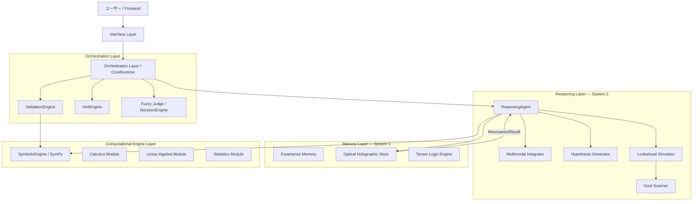

# COHERENT

> **Intelligence in Phase. Where Waves Become Logic.**
> **Transformer に依らない推論は成立するか**——を検証する理論検証プロジェクト。

| | |
|---|---|
| **リポジトリ** | https://github.com/chigenori053/COHERENT |
| **開始** | 2025-11 |
| **性格** | **理論検証プロジェクト** |
| **推論モデル名** | **BrainModel**（現行 v2.0） |
| **主要言語** | Python 3.12（約43,000行 / 327ファイル）· Jupyter Notebook |
| **規模** | ドキュメント53本 · テスト30ファイル · 実験レポート約20本 |
| **ライセンス** | 全権利留保 |

**COHERENT はプロジェクトのブランド名**であり、その中核にある推論モデルが **BrainModel** です。
リポジトリ内では `CognitiveCore` · `ReasoningEngine` · `ObservationCore` · `SimulationCore` が
いずれも "BrainModel v2.0" として実装されています。

---

## プロジェクトの目的

**Transformer 以外の推論モデルで、LLM と同様または近い推論を実現できるか**——
これを検証することが目的です。製品開発ではなく、**仮説検証**が主眼にあります。

### 中核となる仮説

> **情報の密度を上げることで、ニューラルネットワークに頼らない推論が可能になるか。**

巨大なパラメータ集合による近似ではなく、**表現そのものの情報密度**によって推論を成立させられないか、
という問いです。この仮説を、2つの技術で検証しました。

---

## 仮説検証技術① — HolographicMemory（光学記憶）

**物理現象である光学干渉を数理的にシミュレーション**し、以下が可能かを検証します。

- 推論、とりわけ **正しい / あいまい / 間違い** の判定ができるか
- **言語生成（想起）** ができるか

三値判定は実装にそのまま現れており、`MemorySpace` は
**`AcceptStore` / `ReviewStore` / `RejectStore`** の3つの格納領域と `MemoryRouter` で構成されています。
判定結果は `ProcessingResult` として、`Action`（判定）と `DecisionLog`（根拠）を必ず伴って返されます。

> *"Corresponds to the 'Accept / Review / Reject' layer concept —
> this object carries the final status (Action) and the proof (Log)."*
> — `coherent/core/memory/space/layers.py`

**判定に必ず根拠ログを添える**という設計は、後の MRA における Evidence / Provenance に繋がっています。

### 3層のホログラフィックメモリ

> *"Implements a 3-Layer Memory Architecture (Dynamic, Static, Causal)
> based on Holographic Associative Memory principles."*
> — `coherent/core/memory/holographic/__init__.py`

| 層 | 役割 |
|---|---|
| **DynamicHolographicMemory (DHM)** | 短期・動的な記憶。言語意味空間を埋め込む層 |
| **StaticHolographicMemory** | 定着した長期記憶。Dynamic からの昇格先 |
| **CausalHolographicMemory** | 因果関係と意思決定状態（`DecisionState` / `Action`） |

`MemoryOrchestrator` が3層の相互作用を管理し、Dynamic への格納 → Static への昇格判定 →
因果リンクの誘導、という流れを制御します。

---

## 仮説検証技術② — MemorySpace（永続記憶 + 計算空間）

**永続化した HolographicMemory を保存する記憶領域と、推論を実行する計算空間**を構築し、
次の運用が成立するかを検証します。

```
  推論要求
     │
     ▼
  記憶を検索  ──── 該当する記憶がある ────▶ 想起（Recall）で応答
     │                                        計算コストほぼゼロ
     │ 該当なし
     ▼
  推論を実行（Compute）
     │
     ▼
  結果を永続化 ──▶ 次回は想起で済む
```

**「記憶があるなら計算しない」**——計算資源を高効率に運用する推論システムが成立するか、という検証です。

---

## 検証結果

> **先に結論を確認したい場合は、[検証結果と証拠の強さ](#検証結果と証拠の強さ)の一覧表をご覧ください。**
> どの主張が実測に裏付けられ、どれが設計確認・未測定・再現不可なのかを整理してあります。

### 計算資源の効率化 — 設計確認のみ（性能は未測定）

> **注記：** 本項の数字は**性能ベンチマークではありません。**
> ポートフォリオ作成時に一次データを検めた結果、当初「計算削減 80% を実証」と
> 記載していた内容は誇張でした。以下は訂正後の記述です。

`report/PHASE_B_REPORT.md`（Recall Boundary Sweep）は、想起しきい値 θ を振ったときに
Recall と Compute の切り替えが意図どおり動くかを確認するテストです。

| θ | L0 | L1 | L2 | L3 | L4 | Compute を回避した割合 |
|---|---|---|---|---|---|---|
| 0.95 | ✔ | ✖ | ✖ | ✖ | ✖ | 20.0% |
| 0.90 | ✔ | ✔ | ✖ | ✖ | ✖ | 40.0% |
| 0.80 | ✔ | ✔ | ✔ | ✖ | ✖ | 60.0% |
| **0.70** | ✔ | ✔ | ✔ | ✔ | ✖ | **80.0%** |

L0 = 完全一致 / L1 = 項順序違い / L2 = 簡約違い / L3 = 結合則違い / L4 = 複合差分。
**構造が違っても意味が同じなら想起する**、という段階的な設計になっています。

#### この数字が意味しないこと

一次データ（`report/PHASE_B_LOG.json` と `tests/test_phase_b_sweep.py`）を確認すると、
次の制約があります。

| 項目 | 実態 |
|---|---|
| サンプル数 | **5件**（`x + y` / `5b + 3a` / `2x` / `(x + y) + z` / `2x + y`） |
| 共鳴スコア | **テストコード内の定数**（`"L1": 0.92, "L2": 0.82` …）。実測値ではない |
| 計算コスト | 定数 `compute_steps = 10` |
| 「80%」の意味 | θ=0.7 のとき 5件中4件が Recall に回った、という比率 |

したがって **「計算量を 80% 削減した」とは言えません。**
言えるのは「しきい値を下げると想起される差分レベルが増え、L4 は安全側に抑制される」という
**設計意図どおりの挙動が確認できた**ことまでです。

実ワークロードでの計算削減率は**まだ測定していません。**
測定するには、代表的な問題集合・ベースライン・共鳴スコアの実測が必要です。

`report/PHASE_A_REPORT.md`（Behavior Test）では、Recall と Compute の切り替えを10ケースで検証し、
**全ケース PASS**。完全一致では Recall が発火し、構造差分では Compute にフォールバックしています。

### 言語生成 — 部分的に成功

言語意味空間を埋め込んだ **DynamicHolographicMemory を含む3つの HolographicMemory** で構成した
MemorySpace により検証しました。

**特筆すべき制約**：記号そのものは記憶に保存していません。
属性ホログラム（`H_attr`）のみを保存し、そこから記号を**動的に生成（想起）**しています。

> *"symbolic entities (letters, digits, Roman numerals) can be dynamically generated from
> abstract attribute holograms without storing the symbols themselves in memory."*
> — `experimental/reports/DHM_generation_report.md`

#### 文字生成

| 対象 | 結果 | 備考 |
|---|---|---|
| アルファベット（A-Z） | 成功 | 属性: TYPE / CASE / POSITION / ROLE / SHAPE / COMPLEXITY。衝突解消のため `PHONETIC_CLASS` を追加し、次元を 1024 → **2048** に拡張 |
| 数字 · ローマ数字 | 成功 | 決定論的な DDIM 拡散による生成 |
| **カタカナ（46文字）** | **正解率 100%（46/46）** | 平均共鳴マージン **0.835**。音韻的特徴（母音・子音）に基づく属性マッピング |
| **漢字** | **60〜80%** | 基礎 70% / 構造 80% / 高密度 60% |

> **再現性の注記：** カタカナと漢字の結果は `Stage3_Katakana_Kanji_Result_Report.md` に
> 記録されていますが、レポートが参照する生成スクリプト
> （`experimental/katakana_generation/runner_katakana.py` ·
> `experimental/stage3_kanji_single_char/runner_kanji.py`）は
> **現在のリポジトリに含まれていません。** したがって第三者による再現はできません。
> 数字はレポートの記載として扱ってください。

**漢字が「部分的」の理由は、容量不足ではありません。**
1024次元から2048次元に拡大しても正解率が変化しなかったことから、
原因は直交性の不足ではなく**属性定義の重複**であると特定されています。
`一`/`二`/`三`、`休`/`信`/`体`、`議`/`識` などが同一の属性定義に落ちて衝突しました。

> エンコードロジック自体は正常に機能している。漢字の識別には、
> 第2部首や画数を含むより詳細な属性定義が必要——というのが結論です。

#### 単語生成・多言語

`DHM_WORD_GEN_REPORT.md` / `DHM_WORD_GEN_P2_REPORT.md` より。
**日本語30語 + 英語30語 = 60語を共有 DHM に格納**（1024次元）した条件での検証です。

| 検証 | 手がかり | 結果 |
|---|---|---|
| Baseline | 完全一致 | **100%**（60/60） |
| Prefix Cue | 読みの先頭2文字 | **100%**（60/60） |
| Semantic Cue | 語義（Gloss） | **100%**（60/60） |
| Cue Fusion | Prefix + Gloss | **100%**（60/60、Rank 1） |

**多言語の共存に成功しています。** 混在環境での性能劣化率は **0.00%**。

> **証拠：** この結果は `experimental/reports/p1_word_gen_baseline.csv`（60行）に
> **実測の共鳴値つきで残っています**（例: `ひかり, exact_surface, 0.5650427614979858, True`）。
> 本プロジェクトで**最も裏付けの強い成果**です。
さらに言語をまたいだ連想も確認されました——`light` で問い合わせると
**`ひかり` と `light` の両方**が想起されます。

そして手がかりを融合させると曖昧性が解消されます。
語義 `light` だけでは `ひかり` が Rank 1 でしたが、読み `li` を加えると英語の `light` が Rank 1 に浮上する。
レポートはこれを **"Tip-of-the-tongue"（喉まで出かかっている状態）の解消**と表現しています。

双方向の連想も 100%（EN語義 → JP表層 / JP表層 → EN語義の抽出）で成立しました。

### 数式の正誤判定 — 成功

手入力した数式に対する正誤・同値判定を検証しました。

`report/PHASE0_REPORT.md` では、交換法則（`x + y` ≡ `y + x`）が構造ハッシュのみで一致すること、
結合法則と等価簡約は構造ハッシュだけでは不足し **SymPy による簡約が必要**であることが切り分けられています。

`report/PHASE_A_REPORT.md` では、それらを含めた10ケースで判定が全て PASS。
検証対象は `docs/Math_Curriculum_Test_Items.md` として中学〜高校の学習指導要領に沿って整理されており、
`Verify -5 + 8 - (-3) = 6` のような等式検証から、展開・因数分解・二次方程式まで含まれます。

### 自然言語の理解・生成

副次的にですが、`report/PHASE_C_REPORT.md` で自然言語の条件文理解を18件検証し **100% PASS**。
`D-1` / `D-2` では、意味構造からの**文生成と、生成文の逆解析による意味一致検証**（forward + reverse）が
成立しています。

---

## アーキテクチャ



**Recall-First（想起優先）** アーキテクチャを採用し、人間の認知プロセス——
System 1（直感的想起）と System 2（論理的推論）のハイブリッド——を模倣しています。

### 三層の責務分離

| レイヤー | 責務 |
|---|---|
| **Layer A: Interface** | **Semantic Parser** — 自然言語を解析し、構造化されたタスク（Semantic IR）に変換 |
| **Layer B: Core** | **Action Executor** — アクションを実行し、状態を更新<br>**Tracer** — 実行ログを記録 |
| **Layer C: Physics** | **Optical Engine** — 複素数演算による記憶の想起と干渉シミュレーション |

物理層（Physics）が独立したレイヤーとして存在するのが特徴的です。

---

## 3つの中核機能

### 1. Optical Holographic Memory（光学干渉メモリ）

脳の海馬のような、長期的かつ連想的な記憶を実現します。

- **Resonance Recall** — 入力情報（波）と記憶（波）の**干渉強度（Resonance）**によって、
  最も関連性の高い過去の経験を瞬時に想起する
- **Encoding** — テキスト・画像・音声を**複素数テンソル（Holographic Tensor）**にエンコードし、
  同一空間で扱う

類似度検索ではなく干渉として想起を定式化することで、マルチモーダルな入力を単一空間に統合しています。

### 2. Reasoning Agent（推論エージェント）

System 2（熟慮的思考）を担当します。

- **Action-Based** — 思考を「ツールの使用」「ルールの適用」「記憶の検索」といった
  **離散的な Action** として出力する
- **Self-Correction** — 実行結果（Execution Result）を観察し、自身の仮説を修正しながらゴールに向かう

### 3. Traceability & Learning（追跡可能性と学習）

- **Tracer** — すべての思考ステップ（State → Action → Result）をエピソードとして記録
- **Feedback Loop** — 成功したエピソードは光学メモリにフィードバックされ、
  **「直感（System 1）」として定着する**

推論（System 2）で得た成功が、想起（System 1）に沈殿していく——という学習ループが設計されています。

---

## モジュール構成

`coherent/core/` に59のPythonモジュール。主要な系統：

| 系統 | モジュール |
|---|---|
| **記憶** | `memory/` `memory/holographic/` `optical/` `cortex/memory/` |
| **推論** | `reasoning/` `reasoning_engine.py` `cognitive_core.py` `heuristics.py` `proof_engine.py` |
| **実行** | `executor.py` `fast_executor.py` `action.py` `action_types.py` `orchestrator.py` `tracer.py` |
| **計算エンジン** | `symbolic_engine.py` `calculus_engine.py` `linear_algebra_engine.py` `stats_engine.py` `geometry_engine.py` `trig_engine.py` `polynomial.py` `fraction_engine.py` |
| **判断** | `decision_theory.py` `fuzzy/` `validation_engine.py` `classifier.py` `task_gate.py` |
| **因果** | `causal/` |
| **マルチモーダル** | `multimodal/` `tensor/` |
| **言語** | `language_engine.py` `parser.py` `input_parser.py` `translation_engine.py` `transform_intent_parser.py` |
| **シミュレーション** | `simulator.py` `simulation_core.py` `observation_core.py` |

---

## Cognitive Simulator — 思考の可視化UI

```bash
uv run streamlit run coherent/tools/memory_simulator/app.py
```

リアルタイムで推論プロセスと記憶の干渉を可視化する、インタラクティブUI。

- **Cognitive Visualization** — テキスト・画像・音声のマルチモーダル入力に対する想起プロセスを、
  **波の干渉として可視化**
- **Traceability** — 思考の各ステップ（Recall → Reasoning → Decision）をタイムラインで詳細に追跡

「記憶を波として扱う」というモデルが、そのまま可視化として成立している点が面白い部分です。

---

## コードから呼ぶ

```python
from coherent.apps.edu.app import get_system
from coherent.core.state import State
from coherent.core.tracer import Tracer

system = get_system()
agent = system["agent"]
executor = system["executor"]
tracer = Tracer()

expression = "x^2 - 4 = 0"
state = State.from_string(expression)
tracer.start_episode(expression)

# 推論ループ
action = agent.act(state)
result = executor.execute(action, state)
tracer.log_step(state, action, result)

print(f"Action: {action.name}, Valid: {result['valid']}")
```

`agent.act()` → `executor.execute()` → `tracer.log_step()` という
**「思考する・実行する・記録する」の三段構え**がAPIにそのまま出ています。

---

## 主要ドキュメント

| ドキュメント | 内容 |
|---|---|
| `COHERENT_System_Architecture.md` | システムアーキテクチャ全体像 |
| `COHERENT_LM_Architecture.md` | 言語モデルアーキテクチャ |
| `COHERENT_Language_Processing_Design.md` | 言語処理設計 |
| `CausalScript_DSL_Specification.md` | 因果記述DSLの仕様 |
| `CRS_Memory_Library_Spec_v0_1.md` | CRS メモリライブラリ仕様 |
| `Multimodal_Specification.md` | マルチモーダル仕様 |
| `COHERENT_Edu_Hint_Generation_AgentSpec.md` | 教育向けヒント生成エージェント仕様 |
| `Supported_Math_Knowledge.md` / `Math_Curriculum_Test_Items.md` | 対応数学知識・カリキュラム試験項目 |

---

## セットアップ

```bash
git clone https://github.com/chigenori053/COHERENT.git
cd COHERENT
uv init && uv python install 3.12 && uv sync
```

Python 3.12 以上が必要です。

---

## 検証プロジェクトとしての総括

**仮説の全面的な立証には至っていませんが、否定もされていません。**
「情報の密度を上げることでニューラルネットワークに頼らない推論が可能か」という問いに対し、
検証結果は次のように分かれました。

### 検証結果と証拠の強さ

同じ「検証結果」でも、裏付けの強さは項目ごとに大きく異なります。
評価しやすいよう、証拠の種別を明示します。

| 検証項目 | 結果 | 証拠の強さ | 一次データ |
|---|---|---|---|
| **単語・多言語の想起** | 60語で 100%、劣化率 0.00% | **実測データあり** | `p1_word_gen_baseline.csv` ほか（実測共鳴値つき60行） |
| **数式の正誤・同値判定** | 成功 | **実行結果あり** | `PHASE0_REPORT.md` / `PHASE_A_REPORT.md`（10ケース） |
| **三値判定の成立** | 実装・運用されている | **コードで確認可能** | `coherent/core/memory/space/`（Accept/Review/Reject + DecisionLog） |
| **自然言語の条件文理解** | 18/18 | 実行結果あり | `PHASE_C_REPORT.md` / `D-1` / `D-2` |
| 文字生成（カタカナ・漢字） | 100% / 60〜80% | ⚠️ **再現不可** | レポートのみ。生成スクリプトが未収録 |
| 記憶再利用による計算削減 | — | ❌ **未測定** | 5件の固定シナリオによる設計確認のみ |
| LLM 同等の汎用推論 | **未到達** | — | — |

漢字生成の限界が**記憶容量ではなく属性定義の設計に起因する**と特定できたことは、
仮説そのものへの反証ではなく、**符号化設計の課題**として切り分けられたことを意味します。

一方で、**「記憶があれば計算しない」という中核の効率化仮説は、まだ検証されていません。**
機構は実装されており設計どおり動くことは確認できていますが、
実ワークロードでの効果を測る実験がこれからの課題です。

## 後続への継承

COHERENT は、mathlang で得た「推論過程を記述可能にする」という発想を、
**記憶の物理モデルと自律的な推論ループにまで拡張**したプロジェクトです。
そしてここでの検証結果が、系譜の後続を規定しています。

| COHERENT での知見 | 後続への継承 |
|---|---|
| 想起は候補を出し、確定は検証が行う | [LanguageModel](languagemodel.md) の **Truth Boundary** |
| Accept / Review / Reject の三値判定 | [VisionWorldModel](visionworldmodel.md) の **ACCEPT / REVISE / DEFER / ABSTAIN** |
| 判定に必ず `DecisionLog`（根拠）を添える | MRA の **Evidence / Provenance** |
| 記憶があるなら計算しない、という運用方針 | MRA の連想活性化、[Design_BrainModel](design-brainmodel.md) の**コード想起** |
| HolographicMemory を推論の中核に据える構想 | Design_BrainModel v1 に引き継がれ、**そこで限界に突き当たる** |

最後の行が重要です。COHERENT で有望に見えた HolographicMemory と MemorySpace は、
Design_BrainModel v1 で実運用規模に載せた際に
[3つの限界](design-brainmodel.md#v1-が直面した限界)——推論爆発・学習能力の不足・容量の非現実性——に直面しました。

**検証環境で成立したものが、実運用規模では成立しなかった。**
この落差が、[ReasonScript](reasonscript.md) を基盤から作る判断につながっています。

→ [設計思想の詳細](../design-philosophy.md) · [開発年表](../timeline.md)
