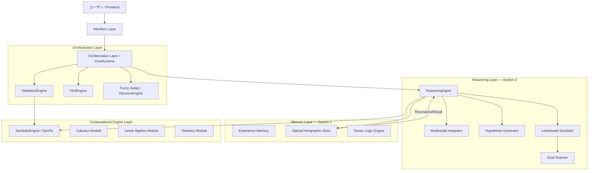

# COHERENT System 2.0

> **Intelligence in Phase. Where Waves Become Logic.**
> 光学干渉メモリとアクション予測型推論を融合した、次世代の論理推論システム（Reasoning LM）。

| | |
|---|---|
| **リポジトリ** | https://github.com/chigenori053/COHERENT |
| **開始** | 2025-11 |
| **主要言語** | Python 3.12（約43,000行 / 327ファイル）· Jupyter Notebook |
| **規模** | ドキュメント53本 · テスト30ファイル |
| **状態** | Phase 2（Coding Agent Integration）に向けて開発中 |

---

## コンセプト

一般的な言語モデルは「次のトークン」を予測します。COHERENT は **「次のアクション（思考のステップ）」を予測し、
実行し、検証する**自律ループを回します。

そして記憶を、ベクトルデータベースではなく**波の干渉**としてモデル化しています。

---

## アーキテクチャ



**Recall-First（想起優先）** アーキテクチャを採用し、人間の認知プロセス——
System 1（直感的想起）と System 2（論理的推論）のハイブリッド——を模倣しています。

### 三層の責務分離

| レイヤー | 責務 |
|---|---|
| **Layer A: Interface** | **Semantic Parser** — 自然言語を解析し、構造化されたタスク（Semantic IR）に変換 |
| **Layer B: Core** | **Action Executor** — アクションを実行し、状態を更新<br>**Tracer** — 実行ログを記録 |
| **Layer C: Physics** | **Optical Engine** — 複素数演算による記憶の想起と干渉シミュレーション |

物理層（Physics）が独立したレイヤーとして存在するのが特徴的です。

---

## 3つの中核機能

### 1. Optical Holographic Memory（光学干渉メモリ）

脳の海馬のような、長期的かつ連想的な記憶を実現します。

- **Resonance Recall** — 入力情報（波）と記憶（波）の**干渉強度（Resonance）**によって、
  最も関連性の高い過去の経験を瞬時に想起する
- **Encoding** — テキスト・画像・音声を**複素数テンソル（Holographic Tensor）**にエンコードし、
  同一空間で扱う

類似度検索ではなく干渉として想起を定式化することで、マルチモーダルな入力を単一空間に統合しています。

### 2. Reasoning Agent（推論エージェント）

System 2（熟慮的思考）を担当します。

- **Action-Based** — 思考を「ツールの使用」「ルールの適用」「記憶の検索」といった
  **離散的な Action** として出力する
- **Self-Correction** — 実行結果（Execution Result）を観察し、自身の仮説を修正しながらゴールに向かう

### 3. Traceability & Learning（追跡可能性と学習）

- **Tracer** — すべての思考ステップ（State → Action → Result）をエピソードとして記録
- **Feedback Loop** — 成功したエピソードは光学メモリにフィードバックされ、
  **「直感（System 1）」として定着する**

推論（System 2）で得た成功が、想起（System 1）に沈殿していく——という学習ループが設計されています。

---

## モジュール構成

`coherent/core/` に59のPythonモジュール。主要な系統：

| 系統 | モジュール |
|---|---|
| **記憶** | `memory/` `memory/holographic/` `optical/` `cortex/memory/` |
| **推論** | `reasoning/` `reasoning_engine.py` `cognitive_core.py` `heuristics.py` `proof_engine.py` |
| **実行** | `executor.py` `fast_executor.py` `action.py` `action_types.py` `orchestrator.py` `tracer.py` |
| **計算エンジン** | `symbolic_engine.py` `calculus_engine.py` `linear_algebra_engine.py` `stats_engine.py` `geometry_engine.py` `trig_engine.py` `polynomial.py` `fraction_engine.py` |
| **判断** | `decision_theory.py` `fuzzy/` `validation_engine.py` `classifier.py` `task_gate.py` |
| **因果** | `causal/` |
| **マルチモーダル** | `multimodal/` `tensor/` |
| **言語** | `language_engine.py` `parser.py` `input_parser.py` `translation_engine.py` `transform_intent_parser.py` |
| **シミュレーション** | `simulator.py` `simulation_core.py` `observation_core.py` |

---

## Cognitive Simulator — 思考の可視化UI

```bash
uv run streamlit run coherent/tools/memory_simulator/app.py
```

リアルタイムで推論プロセスと記憶の干渉を可視化する、インタラクティブUI。

- **Cognitive Visualization** — テキスト・画像・音声のマルチモーダル入力に対する想起プロセスを、
  **波の干渉として可視化**
- **Traceability** — 思考の各ステップ（Recall → Reasoning → Decision）をタイムラインで詳細に追跡

「記憶を波として扱う」というモデルが、そのまま可視化として成立している点が面白い部分です。

---

## コードから呼ぶ

```python
from coherent.apps.edu.app import get_system
from coherent.core.state import State
from coherent.core.tracer import Tracer

system = get_system()
agent = system["agent"]
executor = system["executor"]
tracer = Tracer()

expression = "x^2 - 4 = 0"
state = State.from_string(expression)
tracer.start_episode(expression)

# 推論ループ
action = agent.act(state)
result = executor.execute(action, state)
tracer.log_step(state, action, result)

print(f"Action: {action.name}, Valid: {result['valid']}")
```

`agent.act()` → `executor.execute()` → `tracer.log_step()` という
**「思考する・実行する・記録する」の三段構え**がAPIにそのまま出ています。

---

## 主要ドキュメント

| ドキュメント | 内容 |
|---|---|
| `COHERENT_System_Architecture.md` | システムアーキテクチャ全体像 |
| `COHERENT_LM_Architecture.md` | 言語モデルアーキテクチャ |
| `COHERENT_Language_Processing_Design.md` | 言語処理設計 |
| `CausalScript_DSL_Specification.md` | 因果記述DSLの仕様 |
| `CRS_Memory_Library_Spec_v0_1.md` | CRS メモリライブラリ仕様 |
| `Multimodal_Specification.md` | マルチモーダル仕様 |
| `COHERENT_Edu_Hint_Generation_AgentSpec.md` | 教育向けヒント生成エージェント仕様 |
| `Supported_Math_Knowledge.md` / `Math_Curriculum_Test_Items.md` | 対応数学知識・カリキュラム試験項目 |

---

## セットアップ

```bash
git clone https://github.com/chigenori053/COHERENT.git
cd COHERENT
uv init && uv python install 3.12 && uv sync
```

Python 3.12 以上が必要です。

---

## この設計の背景にある考え方

COHERENT は、mathlang で得た「推論過程を記述可能にする」という発想を、
**記憶の物理モデルと自律的な推論ループにまで拡張**したプロジェクトです。

ここで確立された「想起は候補を出すだけ、確定は検証が行う」という分離は、
後の [LanguageModel](languagemodel.md) の **Truth Boundary** に、
「観測と推論を分ける」という発想は [VisionWorldModel](visionworldmodel.md) に受け継がれています。

→ [設計思想の詳細](../design-philosophy.md)
