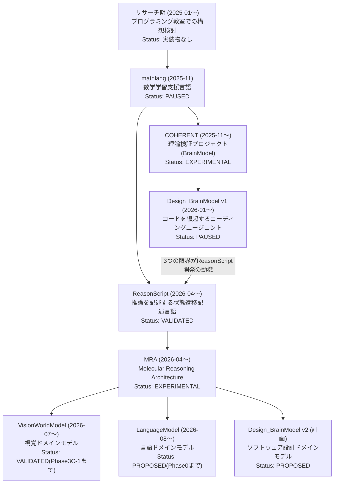

# 研究系譜 — Research & Development Lineage

7つのプロジェクトは独立した製品群ではなく、**MathLangのコンセプトを起点とする一つの研究発展**である。2025年1月のリサーチ期から2026年8月まで、約1年7ヶ月の流れを示す。

## 系譜図



## 問題意識の推移

```
数学教育の構想 → 数学学習支援 → 認知アーキテクチャの理論検証 → ソフトウェア開発の制御
    → 言語処理系の再構築 → 視覚ドメインへの応用 → 言語ドメインへの応用
```

題材は移り変わっているが、問いは一貫している。**「推論を、検査・再現・検証可能にするにはどうすればよいか。」**

---

## 2025年1月〜10月 — リサーチ期: コンセプトを固める

**この期間はコードを伴わないため、GitHub上には実装物として残っていない。**

運営するプログラミング教室で数学学習コースの新設を検討する中で生まれた着想を、専門家への相談と既存サービスの検証を通じてコンセプトへと固めていった期間である。

1. 運営するプログラミング教室で、**数学学習コースの新設**を検討
2. その中で、**学習コーチとしてLLMを活用する**アイディアに着想。ただし当時のLLMは数学計算そのものに問題が残り、生成されるアウトプットも安定していなかった
3. 教育の専門家に相談したところ、**「難しい」**というフィードバックを受けた(当時のLLMの数学計算の不安定さが理由)
4. その後 **SymbolicAI** の存在を知る
5. 続けて、教育分野の既存サービスとして **Wolfram Alpha** を知り、実際にテスト。その結果、実現したかったこと——**入力された数式に対して、途中計算を含めた段階的な評価を行うこと**——ができないと判明した
6. ここから、**MathLangのコンセプト**(途中計算式を含む数式を理解・評価できる、専用の教育言語)に到達した

**探索期の起点であるmathlangは、このリサーチ期の結論をそのまま実装に落としたもの**である。この経験は[Professional Experience](../career/professional_profile.md)のプログラミング教育経験の一部でもある。

---

## 2025年11月 — 探索期の起点: 推論過程を記述する

**mathlang**(2025-11-07)は、中学生以上の学生に向けた数学学習支援プロダクトとして開発された。研究のための実験言語ではない。`step` を `before`/`after`/`note` の三点セットとして構文で強制する設計により、「何を、何に変え、なぜそうしたか」を検査・再生できるデータとして書く、という発想がここで生まれた。

**COHERENT**(2025-11-23)は、mathlangのわずか2週間後に始まった。「Transformer以外の推論モデルでLLMと同様または近い推論を実現できるか」という理論検証プロジェクトであり、HolographicMemoryとMemorySpaceによって「想起→検証」という構図を確立した。

---

## 2026年1月 — 転換: AIの生成そのものを制御する

**Design_BrainModel**(2026-01-24)で対象が数学・推論そのものからソフトウェア開発の現場に移り、使用言語もPythonからRustに変わった。決定論を仕様レベルで凍結する手法がここで確立された一方、**推論爆発・記憶機構の学習不足・容量の非現実性という3つの限界**に突き当たり、v1は未完成プロダクトのまま開発停止となった。この判断が次の転換を生んだ。

---

## 2026年4月 — 基盤: 言語処理系から作り直す

**ReasonScript**(2026-04-12)は、DBM v1の3つの限界を解決するための直接の帰結として、言語処理系そのものを作るという選択から生まれた。推論を状態遷移として記述させることで、各ステップに検証点が生まれ、失敗時の戻り先が定義される。2026-08-12時点でCI全ステージPASS・1,116件のテスト通過を実行確認済み。

---

## 2026年7月〜8月 — MRAへの展開

**VisionWorldModel**(2026-07-24)は、ReasonScriptを実際に使う最初の本格的なプロジェクトであり、観測(VisualAtom)と推論(World構成要素)の分離を確立した。**LanguageModel**(2026-08-10)は、COHERENTで芽生えた「想起は候補、確定は検証」という分離を**Truth Boundary**として明文化し、MRA全体で共有される中核概念を最初に定式化した。

---

## 「分離」という一貫したモチーフ

| プロジェクト | 分離しているもの |
|---|---|
| mathlang | 答え / 過程 |
| COHERENT | 想起(System 1)/ 推論(System 2)、Accept / Review / Reject |
| Design_BrainModel | 設計意図 / システム構造 / コード |
| ReasonScript | 構文 / 意味 / 中間表現 / 実行計画 |
| VisionWorldModel | 観測 / 推論 |
| LanguageModel | 連想記憶 / 正規知識 |

混ぜてはいけないものを混ぜない。これが全体を貫く一貫したモチーフである。

## 現在地(2026-08時点)

| プロジェクト | Status |
|---|---|
| ReasonScript | VALIDATED |
| MRA(アーキテクチャ全体) | EXPERIMENTAL |
| VisionWorldModel | VALIDATED(Phase 3C-1まで) |
| LanguageModel | PROPOSED(Phase 0まで) |
| Design_BrainModel | PAUSED(v1) / PROPOSED(v2) |
| COHERENT | EXPERIMENTAL |
| mathlang | PAUSED |

→ [EDAE(設計思想の詳細)](../methodology/edae.md) · [プロジェクト一覧](../projects/project_index.md) · [アーカイブされた設計](archived_projects.md)
